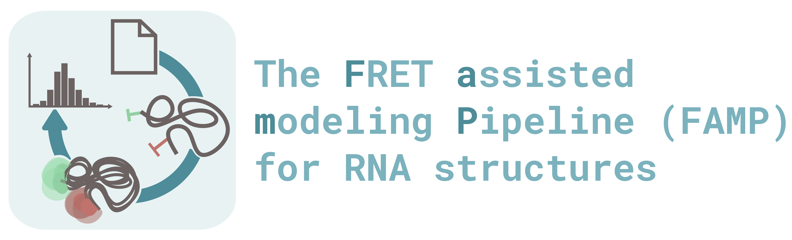

### The Project

This project combines different tools for modeling and simulation of RNA structures. 
Furthermore, functionalities were developed to efficiently analyze MD trajectories of 
labeled RNA. Here, the simulation of FRET experiments plays an essential role. 
Using the pipeline described here, RNA structures can be modeled and evaluated using 
smFRET experimental data.

## Installation

The code can be downloaded under the green button "Code" or cloned via the terminal:
```
git clone https://github.com/felixErichson/FAMP_rna.git
```
<br>

### Requirements
As a dependency of this notebook the following programms should be preinstalled. Please follow the installation instructions of the tools.

[**ViennaRNAPackge**](https://www.tbi.univie.ac.at/RNA/documentation.html#install)

[**Rosetta**](https://new.rosettacommons.org/docs/latest/build_documentation/Build-Documentation)

[**GROMACS**](https://manual.gromacs.org/documentation/2021.2/install-guide/index.html)

Make sure that the programms are added to the bashrc or zshrc file.

Please create an anaconda environment for this Jupyter Notebook by importing the environment.yml file. 

Before you start open Pymol in your environment and install the plugins FRETraj and FRETlabel. Locate the 
package with `fretlabel --path` and remember this path. Then open PymMol and go to Plugin -> Plugin manager -> Install 
New Plugin -> Choose file ... -> and select fretlabel_gui.py, wich can be found at the path from the step bevore. The 
same works for the FRETraj GUI.


### Author

Felix Erichson | erichson(at)hs-mittweida.de
